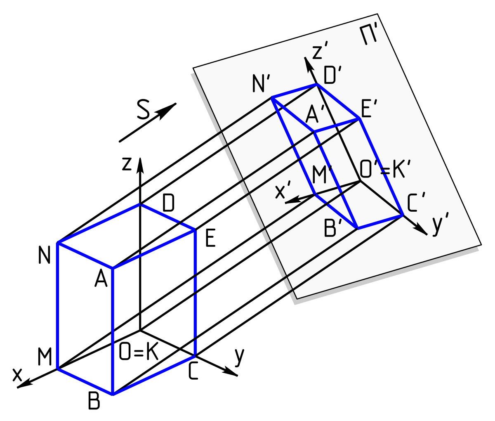

# 3DRender
A simple 3D object render engine in Java

First, use orthographtic projection to draw the frame of the shape.

orthographic projection - representing a 3D object by disregarding a dimension and casting it onto a 2D plane

The projectors are parallel lines that run perpendicular to the plane of projection

